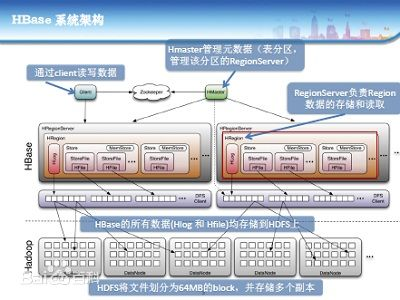
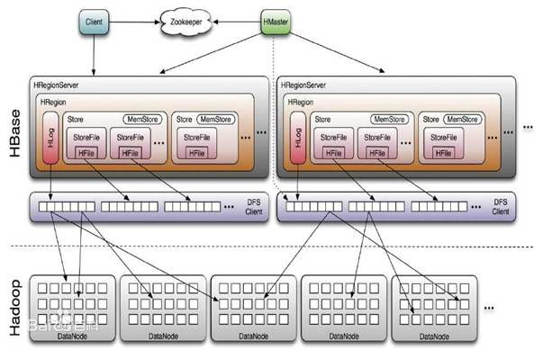

微云（可快速扩充）
====================

大数据-介绍
---------------------

HBase是一个分布式的、面向列的开源数据库，该技术来源于 Fay Chang 所撰写的Google论文“Bigtable：一个结构化数据的分布式存储系统”。就像
Bigtable利用了Google文件系统（File System）所提供的分布式数据存储一样，HBase在Hadoop之上提供了类似于Bigtable的能力。HBase是Apache
的Hadoop项目的子项目。HBase不同于一般的关系数据库，它是一个适合于非结构化数据存储的数据库。另一个不同的是HBase基于列的而不是基于行的模式

Pig和Hive还为HBase提供了高层语言支持，使得在HBase上进行数据统计处理变的非常简单。 Sqoop则为HBase提供了方便的RDBMS数据导入功能，使得传
统数据库数据向HBase中迁移变的非常方便。

* 1. Native Java API，最常规和高效的访问方式，适合Hadoop MapReduce Job并行批处理HBase表数据
* 2. HBase Shell，HBase的命令行工具，最简单的接口，适合HBase管理使用
* 3. Thrift Gateway，利用Thrift序列化技术，支持C++，PHP，Python等多种语言，适合其他异构系统在线访问HBase表数据
* 4. REST Gateway，支持REST 风格的Http API访问HBase, 解除了语言限制
* 5. Pig，可以使用Pig Latin流式编程语言来操作HBase中的数据，和Hive类似，本质最终也是编译成MapReduce Job来处理HBase表数据，适合做数据统计
* 6. Hive，当前Hive的Release版本尚没有加入对HBase的支持，但在下一个版本Hive 0.7.0中将会支持HBase，可以使用类似SQL语言来访问HBase

### 常用场景1 采集的数据离线存储

> 从flume获取数据,存入到hbse；(配置文件使用约定link-name:kafka1)
>
> 使用hbase,查看数据是否存在；
>
> ## 获取数据

数据采集-运行示例
---------------------
### 构造镜像包
> 进入到当前目录
> ## fig build
### 运行
> 进入到当前目录
> ## fig up -d && fig ps
### 观察日志
>
* 建立日志表hive_hbase_log
*
* docker run -v /usr/local/bin:/target jpetazzo/nsenter:latest
*
* 初始化环境：docker-enter cid 进入 hregionserver容器：完成hive-hbase环境准备，和日志表建设，cd /home/jamesmo/ && start pre-start-hive.sh
*
* flume-ng启动：因hbase启动较慢，flume-ng_hbase镜像启动完成的时候hbase条件还不具备，看fig logs initdb完成之后，重新启动一下fig restart flume1,启动日志正常。
* flume-ng_hbase会自动建表，如果有同名表会被覆盖。注意/hbase目录允许所有用户777。
*
*
* 生产数据
* telnet 192.168.59.103 44448
*
* 查看数据-hive数据(hregionserver-node)
*
* sh /home/jamesmo/start-hive.sh  && select * from hive_hbase_log
*
* 查看数据-hbse数据(hregionserver-node)
*
* hbase shell <'scan "hive_hbase_log"'
*
*
> ## flume+kafka示例